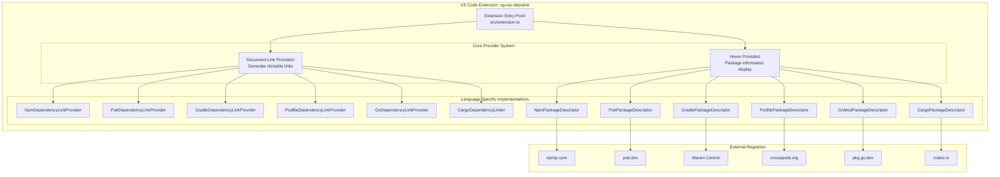
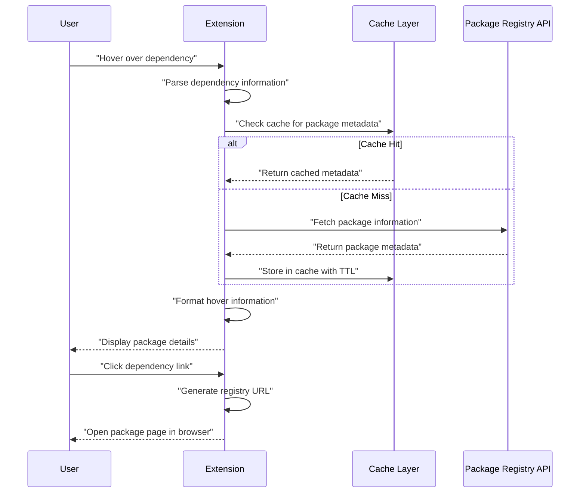

<!--
 * @Author: zdd dongdong@grizzlychina.com
 * @Date: 2025-06-03 11:42:57
 * @LastEditors: zdd dongdong@grizzlychina.com
 * @LastEditTime: 2025-06-06 22:56:55
 * @FilePath: README.md
 * @Description: 这是默认设置,请设置`customMade`, 打开koroFileHeader查看配置 进行设置: https://github.com/OBKoro1/koro1FileHeader/wiki/%E9%85%8D%E7%BD%AE
-->

# VG Depslink - Multi-language Dependency Management Extension

English | [简体中文](README.zh-CN.md)

## Project Overview

VG Depslink is an extension tool developed for Visual Studio Code, aiming to improve developers' efficiency in handling multi-language project dependencies. By automatically identifying package information in dependency files, it provides quick dependency links and hover detail prompts, helping developers obtain key dependency information without manual navigation.

## Core Features

### 1. Multi-language Dependency Link Support

Supports dependency files of mainstream programming languages, automatically generating clickable links to corresponding package management repositories for dependencies (flow diagram shown below):

- npm: Identifies dependencies in package.json and links to npmjs.com
- Dart/Flutter: Identifies dependencies in pubspec.yaml and links to pub.dev
- Gradle: Identifies dependencies in build.gradle and links to Maven Central
- CocoaPods: Identifies dependencies in Podfile and links to cocoapods.org
- Go: Identifies dependencies in go.mod and links to pkg.go.dev
- Rust: Identifies dependencies in Cargo.toml and links to crates.io

### 2. Hover Detail Prompts

When hovering over a dependency, the following key information is displayed (obtained by calling the corresponding repository API):

- Comparison between installed version and latest version (marked if an update is available)
- Package description and license information
- Repository link (prioritizing the project's own repository address)

### 3. Configurability and Extensibility

- Cache Optimization: Supports custom cache time (default 5 minutes) to reduce repeated API requests
- Private Repository Mapping: Supports configuring private repository URL templates (e.g., private repositories for Go modules) to adapt to enterprise internal environments
- Multi-source Support: By extending the BasePackageDescriptor and BaseDependencyLinkProvider base classes, it can quickly add support for other package managers

## Technical Features

- Multi-language Adaptation: Accurately identifies dependency declarations in different formats (e.g., Gradle's short format implementation 'group:name:version' and long format implementation(group: 'group', name: 'name') ) through regular expression matching and syntax analysis
- Error Tolerance: Automatically degrades when API requests fail (e.g., Go modules fall back to GitHub repository search) to ensure basic information availability
- Performance Optimization: Caches package information via the @cacheable decorator to reduce network request frequency

## Application Scenarios

- Cross-language project development (e.g., full-stack projects involving frontend, mobile, and backend simultaneously)
- Dependency version management (quickly check the latest version to avoid manual queries)
- Private repository collaboration (achieve fast navigation for internal dependencies through configuration mapping)
  This extension is open-source on GitHub, supports free use, and is suitable for developers and teams requiring efficient multi-language dependency management.
