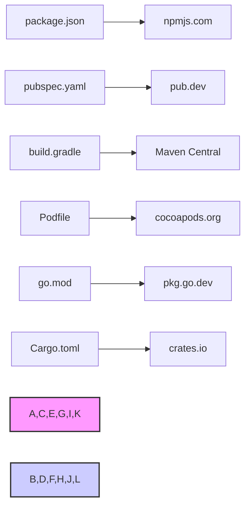

<!--
 * @Author: zdd dongdong@grizzlychina.com
 * @Date: 2025-06-06 11:20:55
 * @LastEditors: zdd dongdong@grizzlychina.com
 * @LastEditTime: 2025-06-06 12:06:09
 * @FilePath: README.zh-CN.md
 * @Description: 这是默认设置,请设置`customMade`, 打开koroFileHeader查看配置 进行设置: https://github.com/OBKoro1/koro1FileHeader/wiki/%E9%85%8D%E7%BD%AE
-->

# VG Depslink - 多语言依赖管理扩展

[English](./README.md) | 简体中文

## 项目概述

VG Depslink 是一款为 Visual Studio Code 开发的扩展工具，旨在提升开发者在处理多语言项目依赖时的效率。通过自动识别依赖文件中的包信息，提供 依赖项快速链接 和 悬停详细信息提示 功能，帮助开发者无需手动跳转即可获取依赖的关键信息。

## 核心功能

### 1. 多语言依赖链接支持

支持主流编程语言的依赖文件，自动为依赖项生成到对应包管理仓库的可点击链接（流程图示如下）：

- npm ：识别 package.json 中的依赖，链接至 npmjs.com
- Dart/Flutter ：识别 pubspec.yaml 中的依赖，链接至 pub.dev
- Gradle ：识别 build.gradle 中的依赖，链接至 Maven Central
- CocoaPods ：识别 Podfile 中的依赖，链接至 cocoapods.org
- Go ：识别 go.mod 中的依赖，链接至 pkg.go.dev
- Rust ：识别 Cargo.toml 中的依赖，链接至 crates.io

### 2. 悬停详细信息提示

鼠标悬停在依赖项上时，显示以下关键信息（通过调用对应仓库 API 获取）：

- 已安装版本与最新版本对比（标注是否可更新）
- 包描述、许可证信息
- 仓库链接（优先使用项目仓库地址）

### 3. 可配置与扩展

- 缓存优化 ：支持自定义缓存时间（默认 5 分钟），减少重复 API 请求
- 私有仓库映射 ：支持配置私有仓库 URL 模板（如 Go 模块的私有仓库），适配企业内部环境
- 多源支持 ：通过扩展 BasePackageDescriptor 和 BaseDependencyLinkProvider 基类，可快速新增对其他包管理器的支持

## 技术特点

- 多语言适配 ：通过正则匹配和语法分析，精准识别不同格式的依赖声明（如 Gradle 的短格式 implementation 'group:name:version' 和长格式 implementation(group: 'group', name: 'name') ）
- 错误容错 ：API 请求失败时自动降级（如 Go 模块回退到 GitHub 仓库搜索），保证基础信息可用
- 性能优化 ：通过 @cacheable 装饰器缓存包信息，减少网络请求频率

## 适用场景

- 跨语言项目开发（如同时涉及前端、移动端、后端的全栈项目）
- 依赖版本管理（快速查看最新版本，避免手动查询）
- 私有仓库协作（通过配置映射实现内部依赖的快速跳转）
  该扩展已在 GitHub 开源，支持免费使用，适用于需要高效管理多语言依赖的开发者和团队。
